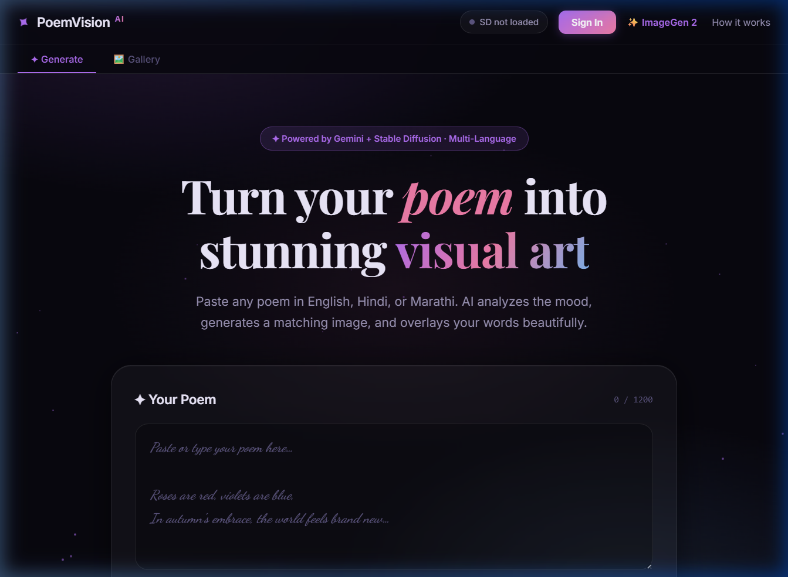
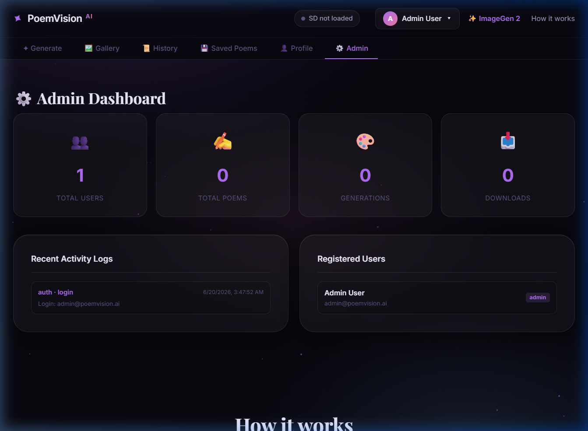
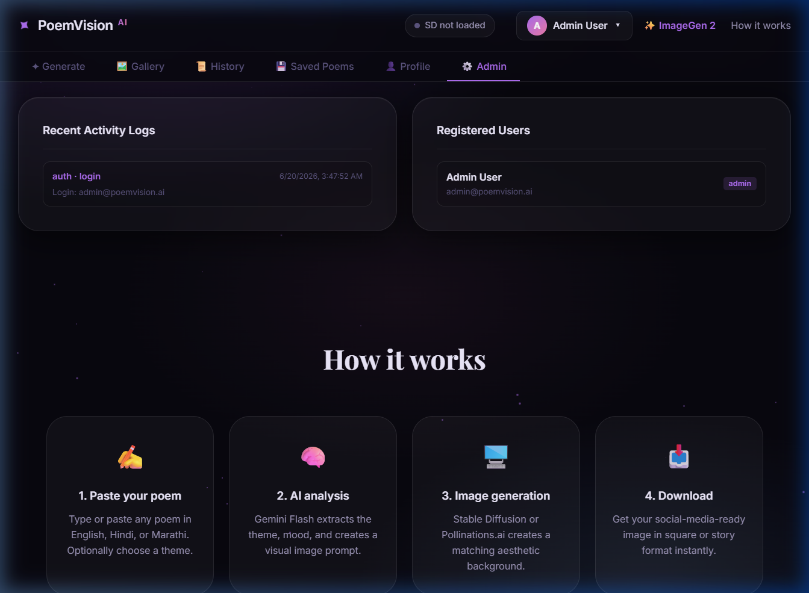

# AI Poem Visualizer (PoemVision AI)

## Overview
AI Poem Visualizer (PoemVision AI) is a premium web application that transforms user-submitted poems in English, Hindi, and Marathi into stunning, customized social-media-ready artwork. The system analyzes the poem's theme and mood to generate a matching background image via AI, and then overlays the poem using beautiful handwriting fonts (complete with high-fidelity Devanagari script layout and shaping).

## Features
- **Poem-Aware NLP Analysis**: Uses Google Gemini Flash to extract themes, moods, and visual prompts from any poem.
- **AI Image Generation**: Generates custom artwork using local Stable Diffusion 1.5 or a fast Pollinations.ai cloud fallback.
- **High-Fidelity Text Overlay**: Combines auto-scaling font size, shadow overlays, and script-specific font selections to composite readable text.
- **Multi-language Support**: Full support for English, Hindi, and Marathi.
- **User Accounts & History**: Register and log in securely (JWT-based) to save poems and view your generation history.
- **Admin Dashboard**: Real-time admin control panel displaying usage statistics, registered users list, and system-wide activity logs.
- **Local ImageGen Sub-App**: Built-in CPU-optimized image generation playground accessible at `/imagegen`.

## Tech Stack
- **Backend API**: Python, FastAPI, Uvicorn
- **Database**: SQLite (via SQLAlchemy 2.0 ORM, easily swappable to PostgreSQL)
- **AI Providers**: Google Gemini Flash API, Stable Diffusion 1.5, Pollinations.ai
- **Image Processing**: Skia-Python (with PIL fallback)
- **Frontend SPA**: HTML5, CSS3 (Vanilla), JavaScript (Vanilla)

## Installation

### 1. Prerequisites
- Python 3.10 or higher
- A free **Google Gemini API key** (available from [Google AI Studio](https://aistudio.google.com/app/apikey))

### 2. Setup Directory
Re-create and activate your virtual environment in the project directory:
```bash
# Create virtual environment
python -m venv .venv

# Activate (Windows)
.venv\Scripts\activate

# Activate (Mac/Linux)
source .venv/bin/activate
```

### 3. Install Dependencies
```bash
pip install -r requirements.txt
```

### 4. Download Handwriting Fonts
Run the font downloader script to automatically fetch and cache the handwriting fonts:
```bash
python -m src.backend.utils.font_downloader
```

### 5. Configure Environment Variables
Create a `.env` file in the project root and add your keys:
```env
GEMINI_API_KEY=your_gemini_api_key_here
GEMINI_MODEL=gemini-1.5-flash
IMAGE_PROVIDER=pollinations
```

### 6. Run the Application
Start the FastAPI server from the entry point:
```bash
python src/main.py
```
Open your browser and navigate to: `http://localhost:8000`

## Screenshots

The project features a premium glassmorphic visual interface:

### 1. Home Page / Generation Panel
Shows the main interface for pasting poems, selecting themes, configuring Stable Diffusion, and starting generation.


### 2. Admin Dashboard
Displays system-wide user counts, total poems, artwork generations, and download statistics.


### 3. System Logs & Reports
Real-time activity logs and user table views for administrators.


## Future Enhancements
- **Custom Fonts**: Allow users to upload their own TrueType (.ttf) fonts for poem composition.
- **Expanded Layouts**: Support extra image aspect ratios (e.g. 4:5 Instagram feed, 16:9 widescreen).
- **Redis Cache**: Migrate rate-limiting and token revocation lists to a high-speed Redis database.

## Author
Pratik Rahul Bamane
